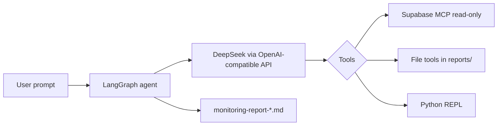

# Supabase Monitoring Agent

An autonomous AI agent that monitors your Supabase project logs, detects anomalies and suspicious activity, and writes timestamped markdown reports. Built with [LangGraph](https://github.com/langchain-ai/langgraph), [LangChain](https://github.com/langchain-ai/langchain), and the official [Supabase MCP server](https://github.com/supabase/mcp-server-supabase) in **read-only** mode.

## Features

- **Log review** — Inspects Supabase logs and project activity via MCP tools
- **Anomaly detection** — Flags auth failures, rate limits, connection errors, repeated 5xx responses, and similar patterns
- **Markdown reports** — Saves structured reports under `reports/` with timestamps
- **Read-only safety** — MCP runs with `--read-only`; the agent is instructed not to mutate databases, schemas, or configuration
- **Stateful runs** — LangGraph checkpointing for multi-step tool use within a session

## How it works



1. You send a monitoring task (e.g. “view current logs and print summary”).
2. The worker LLM plans tool calls against Supabase MCP and local file tools.
3. After analysis, a report is written to `reports/monitoring-report-YYYYMMDD-HHMMSS.md`.

## Prerequisites

| Requirement | Purpose |
|-------------|---------|
| **Python 3.11+** | Runtime |
| **Node.js / npx** | Runs `@supabase/mcp-server-supabase` for MCP |
| **DeepSeek API key** | LLM (`deepseek-v4-flash`) |
| **Supabase access token** | Authenticates the MCP server |

## Installation

```bash
git clone https://github.com/Abhii-04/Supabase-Monitoring-Agent.git
cd Supabase-Monitoring-Agent
```

Create and activate a virtual environment, then install dependencies:

```bash
python -m venv .venv
source .venv/bin/activate   # Windows: .venv\Scripts\activate
pip install -r requirements.txt
pip install langchain-mcp-adapters
```

Or with [uv](https://github.com/astral-sh/uv):

```bash
uv sync
uv pip install langchain-mcp-adapters
```

## Configuration

Create a `.env` file in the project root:

```env
DEEPSEEK_API_KEY=your_deepseek_api_key
SUPABASE_ACCESS_TOKEN=your_supabase_personal_access_token
```

Generate a Supabase access token from [Account → Access Tokens](https://supabase.com/dashboard/account/tokens).

### Link your Supabase project

In `src/tools.py`, set your project reference in the MCP server args:

```python
"--project-ref=YOUR_PROJECT_REF",
```

Find the project ref in the Supabase dashboard URL: `https://supabase.com/dashboard/project/<project-ref>`.

## Usage

Run the default example (reviews logs and prints a summary):

```bash
python main.py
```

### Programmatic use

```python
import asyncio
from src.agent import Agent

async def run():
    agent = Agent()
    await agent.setup()
    result, _ = await agent.run_superstep(
        message="Review recent API logs and summarize errors.",
        suspicious_activity=False,
        history=[],
    )
    print(result["report"])
    print(result["messages"][-1].content)

asyncio.run(run())
```

Reports are saved automatically on each `run_superstep` completion. The agent can also write files under `reports/` via the file-management tools during a run.

## Project structure

```
.
├── main.py              # CLI entry point
├── src/
│   ├── agent.py         # LangGraph agent, system prompt, report persistence
│   └── tools.py         # Supabase MCP + file + Python REPL tools
├── reports/             # Generated reports (gitignored)
├── requirements.txt
└── pyproject.toml
```

## Safety model

The agent operates under a strict read-only policy:

- Supabase MCP is started with `--read-only`
- The system prompt forbids migrations, writes, deletes, and configuration changes
- Only log inspection, analysis, and local markdown output are allowed

If a tool fails or attempts a restricted action, the agent should record the failure in the report and continue with safe read-only steps.

## Environment variables

| Variable | Required | Description |
|----------|----------|-------------|
| `DEEPSEEK_API_KEY` | Yes | API key for DeepSeek (`https://api.deepseek.com`) |
| `SUPABASE_ACCESS_TOKEN` | Yes | Personal access token for Supabase MCP |

## Troubleshooting

- **`npx` / MCP errors** — Ensure Node.js is installed and `npx` can reach the registry. The first run may download `@supabase/mcp-server-supabase`.
- **Authentication failures** — Verify `SUPABASE_ACCESS_TOKEN` and that the token has access to the project in `--project-ref`.
- **Missing `langchain_mcp_adapters`** — Install with `pip install langchain-mcp-adapters`.
- **Empty reports** — Check `reports/` permissions; the directory is created automatically if missing.

## License

This repository does not include a license file yet. Add one before redistributing or using in production.

## Contributing

Issues and pull requests are welcome. When changing MCP or tool behavior, keep read-only guarantees and update this README if setup steps change.
